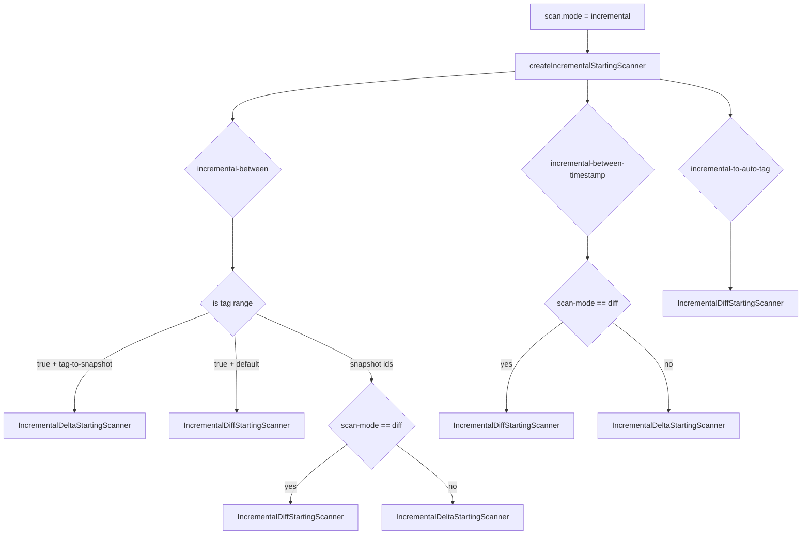

`incremental-between-scan-mode` 是 Paimon 增量批读里最容易“看起来懂了，结果用错”的参数之一。  
表面上它只有 4 个值，但不同值会走完全不同的扫描路径，最终返回的数据语义也不一样。

本文基于 `code/paimon` 源码，围绕以下问题展开：

- 这个参数在代码里到底是怎么定义的？
- `auto / delta / changelog / diff` 的真实语义差异是什么？
- 同样是 `incremental-between='x,y'`，为什么结果会差很多？
- 在生产里该怎么选模式？

## 1. 参数定义与四种模式

在 `CoreOptions` 里，`incremental-between-scan-mode` 定义为枚举，默认值是 `AUTO`。

```java
public static final ConfigOption<IncrementalBetweenScanMode> INCREMENTAL_BETWEEN_SCAN_MODE =
        key("incremental-between-scan-mode")
                .enumType(IncrementalBetweenScanMode.class)
                .defaultValue(IncrementalBetweenScanMode.AUTO);
```

对应枚举值：

```java
public enum IncrementalBetweenScanMode {
    AUTO("auto", "..."),
    DELTA("delta", "..."),
    CHANGELOG("changelog", "..."),
    DIFF("diff", "...");
}
```

四种模式可以先记成一句话：

- `auto`：自动在 `delta/changelog` 里二选一
- `delta`：看“区间内新增的数据文件”
- `changelog`：看“区间内变更日志文件”
- `diff`：做“起止快照状态对比”

## 2. 执行路径总览（图）

下面这个图是 `scan.mode=incremental` 后，和本文相关的主分流逻辑：



这也是后面很多“为什么和预期不一致”的根源：  
**你设了 `incremental-between-scan-mode`，但在某些分支它可能根本不起作用（例如 tag 默认分支）。**

## 3. 四种模式的源码级语义

### 3.1 AUTO：不是第四条路径，而是“自动映射”

`AUTO` 不会产生新算法，它只会在 `toSnapshotScanMode` 中映射为：

- `changelog-producer = none` -> `DELTA`
- 否则 -> `CHANGELOG`

也就是说，`AUTO` 本质是依赖表配置 `changelog-producer` 的“快捷选择器”。

### 3.2 DELTA：扫 delta manifests，偏“文件增量”

`IncrementalDeltaStartingScanner` 在 `DELTA` 下会做两件关键事：

- 仅处理 `APPEND` 快照，忽略 `COMPACT`、`OVERWRITE`
- 读取 `readDeltaManifests`，并校验只有 `ADD` 文件

因此它更接近“这个区间新增了哪些可读数据文件”。

### 3.3 CHANGELOG：扫 changelog manifests，偏“变更事件”

同一个 `IncrementalDeltaStartingScanner` 在 `CHANGELOG` 下会：

- 忽略 `OVERWRITE` 快照
- 读取 `readChangelogManifests`
- 同样只处理 `ADD` 类型的 changelog 文件条目

它强调的是“变更流语义”，而不是最终净变化结果。

### 3.4 DIFF：对比起止快照，偏“净变化”

`DIFF` 走的是 `IncrementalDiffStartingScanner`，内部调用 `readIncrementalDiff(before)`。核心流程是：

1. 读取 end 快照（`ScanMode.ALL`）的 `ADD` 文件集
2. 读取 start 快照的 `ADD` 文件集
3. 按分区/桶聚合后做差分，去重相同文件（`beforeEntries.removeIf(dataEntries::remove)`）
4. 形成 before/after 对照 split

这意味着 `DIFF` 表达的是“区间起点状态 -> 区间终点状态”之间的净差，不是中间每次提交日志。

## 4. 结果差异：一个测试看懂 diff vs delta

在 Flink IT 用例里，同一段区间 `1,8`：

- `incremental-between-scan-mode='diff'` 结果只有 `+I (3,'C')`
- `incremental-between-scan-mode='delta'` 结果是 `+I (2,'B')`、`-D (2,'B')`、`+I (3,'C')`

这非常直观地说明：

- `diff` 关注期末净变化（中间“先加后删”的 B 被抵消）
- `delta` 关注区间内发生过的增量文件事件

## 5. 三个容易踩坑的点

### 5.1 tag 场景默认走 DIFF

当 `incremental-between='tagA,tagB'` 且 `incremental-between-tag-to-snapshot=false`（默认）时，会直接走 `IncrementalDiffStartingScanner`。  
此时你就算设置 `incremental-between-scan-mode='delta'`，也不生效。

只有把 `incremental-between-tag-to-snapshot=true`，tag 才会先转 snapshot id，再走 delta/changelog 路径。

### 5.2 incremental-to-auto-tag 固定是 DIFF 语义

`incremental-to-auto-tag` 的目标是“只给终点 tag，自动回溯到更早 auto tag”，这条路径也是 `DIFF`。  
若终点 tag 不存在，或找不到更早 auto tag，直接空结果。

### 5.3 Batch SQL 对 DELETE 有限制

文档明确写了：Batch SQL 下不允许直接返回 `DELETE` 记录（`-D` 会被丢弃）。  
要看删除事件，请查 `$audit_log`。

## 6. 何时选哪种模式（实践建议）

- 选 `auto`
  - 你希望“跟随表配置自动适配”
  - 团队统一配置了 `changelog-producer`，不想每条 SQL 显式指定

- 选 `delta`
  - 你要按区间拉取新增文件数据做离线回补
  - 更关心“新增可处理文件”，而不是完整变更过程

- 选 `changelog`
  - 你要消费变更语义（例如 update 前后）
  - 上游已产出 changelog 文件

- 选 `diff`
  - 你要的是“起止快照净变化”
  - 典型用于对账、区间快照比较、版本差异提取

## 7. SQL 示例（Flink）

```sql
-- 快照 ID 区间增量
SELECT * FROM t
/*+ OPTIONS('incremental-between' = '12,20') */;

-- 强制使用 diff
SELECT * FROM t$audit_log
/*+ OPTIONS(
  'incremental-between' = '12,20',
  'incremental-between-scan-mode' = 'diff'
) */;

-- tag 区间 + 显式走 snapshot 增量路径
SELECT * FROM t$audit_log
/*+ OPTIONS(
  'incremental-between' = 'tag1,tag3',
  'incremental-between-tag-to-snapshot' = 'true',
  'incremental-between-scan-mode' = 'changelog'
) */;
```

## 8. 关键源码定位（便于继续深挖）

- 参数定义与枚举：`paimon-api/.../CoreOptions.java`
- 增量扫描主分流：`paimon-core/.../AbstractDataTableScan.java`
- delta/changelog 扫描：`paimon-core/.../IncrementalDeltaStartingScanner.java`
- diff 扫描：`paimon-core/.../IncrementalDiffStartingScanner.java`
- diff 计划生成：`paimon-core/.../SnapshotReaderImpl.java`
- manifest 类型分派：`paimon-core/.../ManifestsReader.java`
- 行为对比用例：`paimon-flink-common/.../BatchFileStoreITCase.java`

## 9. 总结

`incremental-between-scan-mode` 的难点，不是记住四个名字，而是理解两套语义：

- `delta/changelog`：按区间“读取过程中的文件/日志”
- `diff`：按起止“计算状态净变化”

一旦把这点和 `tag` 分支规则、`AUTO` 映射规则放在一起理解，Paimon 的增量查询策略就非常清晰了。
